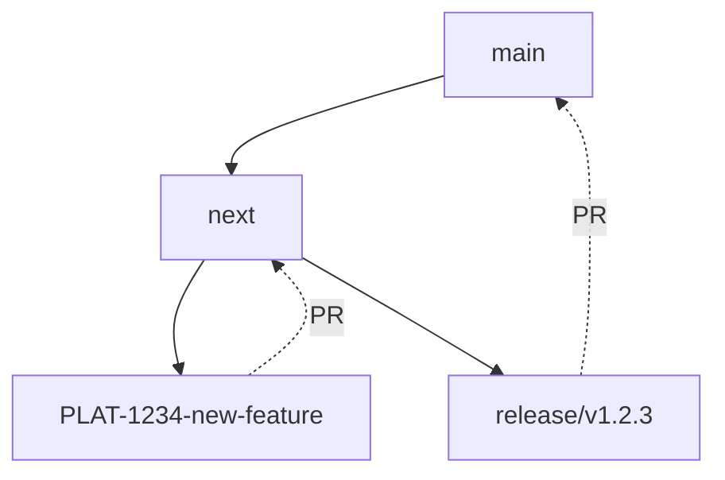

## Releases



### Enhancements and bug fixes

- decide on a new version number, following [semantic versioning](https://semver.org/)
- create a new release branch based on `next` with the new version number in the branch name i.e. `release/vX.Y.Z`
- update the version number and date in the changelog
- create a pull request from your release branch to the `main` branch entitled "Release vX.Y.Z"
- get the release reviewed – all code changes should have been reviewed already, this should be a review of the integration of all changes to be shipped and the updates to the changelog
- consider shipping a [prerelease](#prereleases) to aid testing the release

Once the pull request has been approved:

- merge the pull request

You are now ready to make the release. Releases are done by running the `./scripts/release.sh` script. You MUST ensure that you have the release branch checked out on your local machine and that your working tree is clean or the script will fail. Prerequisites:

- You will need to clone the repository and check out the release branch (usually `main`)
- Ensure you are logged in to npm and that you have access to publish any packages in the `@bugsnag` namespace
- Ensure your `.gitconfig` file in your home directory is configured to contain your name and email address
- Generate a [personal access token](https://github.com/settings/tokens/new) on GitHub and store it somewhere secure

Ensure the following environment variables are set:

- GITHUB_USER
- GITHUB_ACCESS_TOKEN
- RELEASE_BRANCH
- VERSION
- DIST_TAG

Then make the release:

```sh
VERSION=patch \
RELEASE_BRANCH=main \
DIST_TAG=latest
  ./scripts/release.sh
```

This process is interactive and will require you to confirm that you want to publish the changed packages. It will also prompt for 2FA.

<small>Note: if a prerelease was made, to graduate it into a normal release you will want to use `patch` as the version.</small>

Finally:

- create a release on GitHub https://github.com/bugsnag/bugsnag-vega/releases/new
- use the tag vX.Y.Z as the name of the release
- copy the release notes for this version from `CHANGELOG.md`
- publish the release
- raise a PR from `main` to `next` to sync changes

### Prereleases

If you are starting a new prerelease, use one of the following values for the `VERSION` variable in the release command:

```
VERSION=[premajor | preminor | prepatch]
```

For subsequent iterations on that release, use:

```
VERSION=prerelease
```

For example:

```sh
VERSION=preminor \
RELEASE_BRANCH=main \
DIST_TAG=next \
  ./scripts/release.sh
```

**Note**: Prereleases should be published to npm with the dist tag `next`.

The dist tag ensures that prereleases are not installed by unsuspecting users who do not specify a version – npm automatically adds the `latest` tag to a published module unless one is specified.